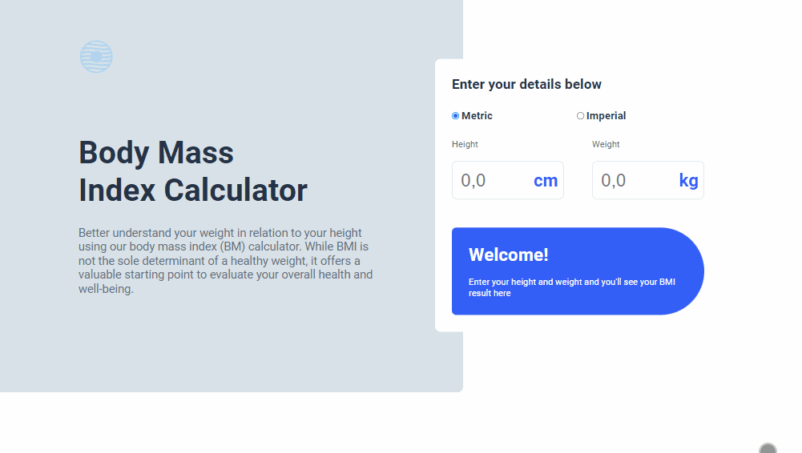

# Desafio Calculadora de BMI - Frontend-Mentor

Este é um desafio de uma calculadora de BMI, proposto pelo site Frontend-Mentor.

## Tabela de Conteúdos

- [Visão Geral](#visão-geral)
    - [Imagens](#imagens)
    - [Link da página](#link)
- [Processo](#processo)
    - [Linguagens utilizadas](#linguagens-utilizadas)
    - [O que aprendi](#o-que-aprendi)
    - [Possíveis evoluções](#possíveis-evoluções)
- [Autor](#autor)

## Visão-geral

### Imagens

<br>

````
Versão de Desktop
````

   

<br>

````
Versão Mobile

````

 

### Link

- Página no GitHub Pages: <a href="https://julio-mansan2.github.io/calculadora-de-bmi/">Clique aqui!</a>

## Processo

### Linguagens utilizadas

<br>

- Marcações semânticas de HTML5
- Propriedades de customização do CSS3
- Estruturas de JavaScript

<br>

### O que aprendi

<br>

- Adicionar elementos ao HTML com JavaScript:

````javascript

else if (totalMetric <= 18.5) {
    result.innerHTML = `
            <div>
                <p>Your bmi is...</p>
                <h2>${totalMetric}</h2>
            </div>
                
            <div>
                <p>You BMI suggest are underweight.</p>
            </div>`;
}

````

- Calcular valores de um input:

````javascript

let bmiValueMetric = (weightInput.value / 1) / (heightInput.value / 100 * heightInput.value / 100);
let totalMetric = bmiValueMetric.toFixed(1);

````
<br>

### Possíveis evoluções

<br>

- Códigos mais compactos;
- Trabalhar melhor com JS;

<br>

## Autor

GitHub - <a href="https://github.com/julio-mansan2">julio-mansan2</a> <br>
Front-end Mentor - <a href="https://www.frontendmentor.io/profile/julio-mansan2">julio-mansan2</a> <br>
LinkedIn - <a href="https://www.linkedin.com/in/j%C3%BAlio-a-mansan-3415a7249/">Júlio A.</a> <br>